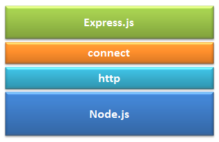

# node-learn
learn node

[学习地址](https://www.tutorialsteacher.com/nodejs/nodejs-tutorials)

## 01-Node.js Console

RERPL：Read-Eval-Print-Loop.

If you need to write multi line JavaScript expression or function then just press **Enter** whenever you want to write something in the next line as continuation of your code.

To exit from the REPL terminal, press **Ctrl + C** twice or write .exit and press Enter.

>  `.help`：Display help on all the commands.

## 03-Node.js Modules

**Node.js Module Types**

Node.js includes three types of modules:

1. Core Modules
2. Local Modules
3. Third Party Modules

**Node.js Core Modules**

The core modules include bare minimum functionalities of Node.js. These core modules are compiled into its binary distibution and load automatically when Node.js process starts. However, you need to import the core module first in order to use it in your application.

| Core Module | Description                                                  |
| ----------- | ------------------------------------------------------------ |
| http        | http module includes classes, methods and events to create Node.js http server. |
| url         | url module includes methods for URL resolution and parsing.  |
| querystring | querystring module includes methods to deal with query string. |
| path        | path module includes methods to deal with file paths.        |
| fs          | fs module includes classes, methods, and events to work with file I/O. |
| util        | util module includes utility functions useful for programmers. |

**Loading Core Modules**

```js
var module = require('module_name')
```

## 05-Export Module

The **module.exports** or **exports** is a special object which is includes in every JS file in the Node.js application by default.  *module* is a varible that represents current module and *exports* is an object that will be exposed as a module. So, whatever you assign to *module.exports* or *exports*, will be exposed as a module.

```js
console.log(module.exports === exports) // true
```

**Load Module from Separate Folder**

Use the full path of a module file where you have exported it using module.exports. For example, if log module in the log.js is stored under "utility" folder under the root folder of your application then import it as shown below.

```js
// app.js
var log = require('./utility/log.js')
```

In the above example, **.** is for folder and then specify exact path of your module file. Node.js also allows us to specify the path to the folder widthout specifing file name. For example, you can specify only utility folder widthout specifing log.js as shown below. 

```js
// app.js
var log = require('./utility')
```

In the above example, Node will search for a package definition file called package.json inside utility folder. This is because Node assumes that this folder is a package and will try to look for a package definition. The package.json file should be in a module derectory. The package.json under utility folder specifies the file name using "main" key as below.

```js
// ./utility/package.json
{
    "name": "log",
    "main": "./log.js"
}
```

Now, Node.js will find log.js file using *main* entry in package.json and import it.

> If package.json file does not exist then it will look for index.js file as a module file by default.

## Node Package Manager

Node Package Manager(NPM) is a command line tool that installs, updates or uninstalls Node.js packages in your application.

```js
npm -v

// update npm
npm install npm -g
```

All the modules installed using NPM are installed under **node_modules** folder.

## Node.js Web Server

A **MIME type** (now properly called "media type", but also sometimes "content type") is a string sent along with a file indicating the type of the file (describing the content format, for example, a sound file might be labeled <kbd>audio/ogg</kbd> , or an image file <kbd>image/png</kbd>).

[List of MIME types](https://www.iana.org/assignments/media-types/media-types.xhtml)

## Node.js File System

**Reading File**

```js
var fs = require('fs')
// asynchronously
fs.readFile('test.txt', 'utf-8', function(err, data) {
    if (err) {
        throw err
    }
    console.log(data)
})

// synchronously
var data = fs.readFileSync('test.txt', 'utf-8')
console.log(data)
```

**Write File**

Use fs.writeFile() method to write data to a file. If file already exists then it overwrites the existing content otherwise it creates a new file and writes data into it.

Use fs.appendFile() method to append the content to an existing file.

```js
var fs = require('fs')

// creating & writing file
fs.writeFile('test.txt', 'Hello World!', function(err) {
    if (err) {
        throw err
    } else {
    	console.log('Write operation complete.') 
    }
})

// append file content
fs.appendFile('test.txt', 'append content', function(err) {
    if (err) {
        console.log(err)
    } else {
        console.log('Append operation complete.')
    }
})
```

**Open File**

**Delete File**

```js
var fs = require('fs')
fs.unlink('test.txt', function() {
    console.log('delete operation complete.')
})
```

## Debugging Node.js

1. Core Node.js debugger
2. Node Inspector
3. Built-in debugger in IDEs

```js
// app.js
var fs = require('fs')
fs.readFile('test.txt', 'utf-8', function(err, data) {
  debugger
  if (err) {
    throw err
  }
  console.log(data)
})

// REPL
// deprecated
node debug app.js

node inspect app.js
watch('data')
watchers
```

Write `help` in debug mode in the Node.js console(REPL).

## Node Inspector

[参考](https://www.npmjs.com/package/node-inspector)

```js
npm install -g node-inspect // 安装
node --inspect-brk app.js // 启动命令，默认端口是9229
```

chrome浏览器里：`chrome://inspect`

## Node.js EventEmitter

There are two common patterns that can be to raise and bind an event using EventEmitter class in Node.js.

1. Return EventEmitter from a function
2. Extend the EventEmitter class

## Frameworks for Node.js

You learned that we need to write lots of low level code ourselves to create a web application using Node.js in *Node.js web server* section.

There are various third party open-source frameworks avalibale in Node Package Manager which makes Node.js application development faster and easy. **You can choose an appropriate frameworks as per your application requirements.**

## Express.js

Express.js is based on the Node.js middleware module called **connect** which in turn uses **http** module. So, any middleware which is based on connect will also work with Express.js.



## Node.js Data Access

Node.js supports all kinds of databases no matter if it is a relational database or NoSQL database. However, NoSQL databases like MongoDB are the best fit with Node.js.

To access the database from Node.js, you first need to install drivers for the database you want to use.

The following table lists important relational databases and respective drivers.

| Relational Databases | Driver                                                 | NPM Command             |
| -------------------- | ------------------------------------------------------ | ----------------------- |
| MS SQL Server        | [mssql](https://www.npmjs.com/package/mssql)           | npm install mssql       |
| Oracle               | [oracledb](https://www.npmjs.com/package/oracledb)     | npm install oracledb    |
| MySQL                | [MySQL](https://www.npmjs.com/package/mysql)           | npm install mysql       |
| PostgreSQL           | [pg](https://www.npmjs.com/package/pg)                 | npm install pg          |
| SQLite               | [node-sqlite3](https://github.com/mapbox/node-sqlite3) | npm install node-sqlite |

The following table lists important NoSQL databases and respective drivers.

| NoSQL Databases | Driver                                                       | NPM Command                         |
| --------------- | ------------------------------------------------------------ | ----------------------------------- |
| MongoDB         | [mongodb](https://www.npmjs.com/package/mongodb)             | npm install mongodb                 |
| Cassandra       | [cassandra-driver](https://www.npmjs.com/package/cassandra-driver) | npm install cassandra-driver        |
| LevelDB         | [leveldb](https://www.npmjs.com/package/leveldb)             | npm install level levelup leveldown |
| RavenDB         | [ravendb](https://www.npmjs.com/package/ravendb)             | npm install ravendb                 |
| Neo4j           | [neo4j](https://www.npmjs.com/package/neo4j)                 | npm install neo4j                   |
| Redis           | [redis](https://npmjs.org/package/redis)                     | npm install redis                   |
| CouchDB         | [nano](https://www.npmjs.com/package/nano)                   | npm install nano                    |

### Mongodb

[参考](https://www.runoob.com/mongodb/mongodb-window-install.html)

[下载](https://www.mongodb.com/download-center/compass)

安装时注意：

- [x] Install MongoDB Compass. 默认是勾选的，**取消掉**。

## Template Engine

The following is a list of import (but not limited) template engines for Node.js.

\> [Jade](https://github.com/pugjs/pug)

\> [Vash](https://github.com/kirbysayshi/vash)

\> [EJS](https://github.com/tj/ejs)

\> [Mustache](https://github.com/janl/mustache.js)

\> [Dust.js](https://github.com/linkedin/dustjs)

\> [Nunjucks](https://github.com/mozilla/nunjucks)

\> [Handlebars](https://github.com/wycats/handlebars.js)

\> [atpl](https://github.com/soywiz/atpl.js)

\> [haml](https://github.com/tj/haml.js)

Advantages of Template engine in Node.js:

1. Improves developer's productivity.
2. Improves readability and maintainability.
3. Faster performance.
4. Maximizes client side processing.
5. Single template for multiple pages.
6. Templates can be accessed from CDN(Content Delivery Network).

### Jade

Jade template must b written inside .jade file. And all .jade files must be put inside **views** folder in the root folder of Node.js application.

By default Express.js seearches all the views in the views folder under the root folder, which can be set to another folder using views property in express e.g. `app.set('views', 'MyViews')`.

### GruntJS

```js
npm install grunt nodemon grunt-nodemon --save-dev
```

Gruntfile.js必须放在根目录（和package.json同目录）

